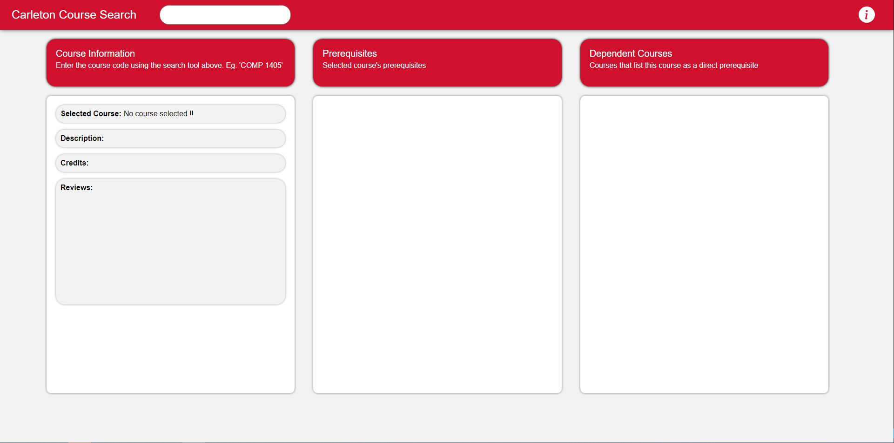
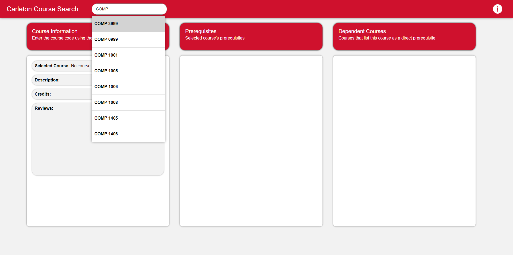
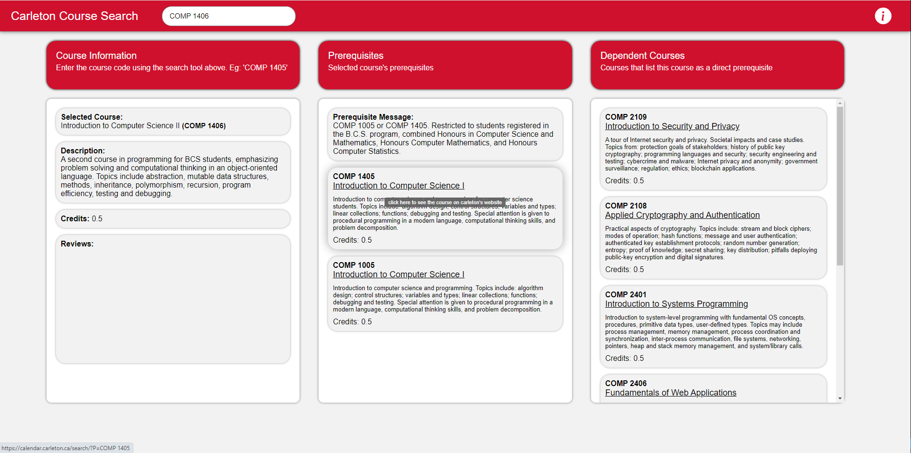
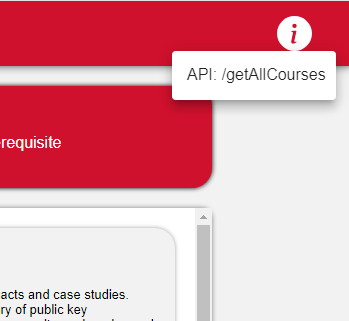

# CourseNavigator

A tool for students at carleton to help schedule their future courses. All course data are scraped from [The official carleton website](https://calendar.carleton.ca/undergrad/courses/)

### Screenshots

<details>
<summary>Click to expand</summary>









</details>

## Setup
This stack contains: React, Typescript, Flask, Python, MaterialUI, Postgresql

Make sure to have the following installed:
  - Node.js 
  - npm (should come bundled with Node.js)
  - Flask 

In the root direcetory, run: `npm install` to install all node dependencies

### Setting up virtual envionment for flask
  CD into the CourseNavigator/backend directory and create a `.venv` file with `python3 -m venv .venv`
  activate the virtual enviroment with `.venv/scripts/activate`
  install all the python dependencies with `pip install -r requirements.txt`

### Adding data and connecting to your database

```python
  # Navigate into your root directory
  # Create a file called .env 
  # Add your database URL, it will look like: DATABASE_URL = 'postgresql://<username>:<password>@<host>:<port>/<database>'
```

  - Now cd into the CourseNavigator/backend directory and run Scraper.py
  - Your database will now be populated with all the course data

### Running the server locally
To run the server make sure:
  - `.env` file contains your database URL
  - additionaly in the `.env` file add ` VITE_API_URL = 'http://127.0.0.1:1111'` and `FRONTEND_URL = 'http://localhost:5173'`
  - The frontend and the backend are both running

```python
  #In the current terminal
  #run:
  npm run dev

  #in a new terminal
  #cd into CourseNavigator/backend
  python server.py

  # You can now view the carleton course tool with: http://localhost:5173
```